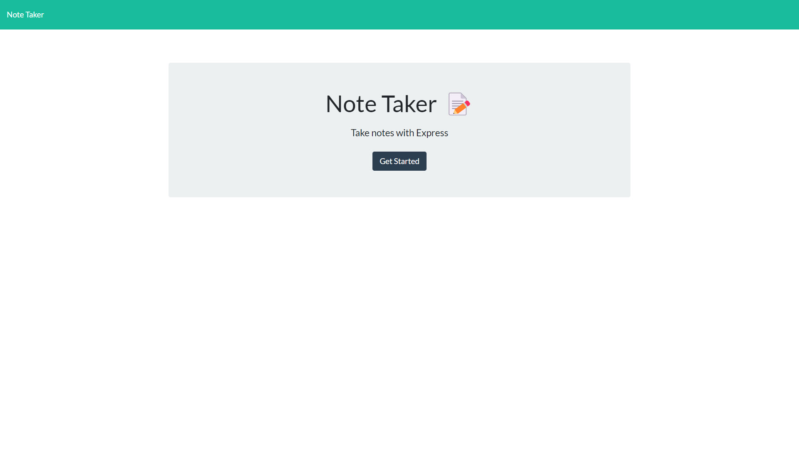
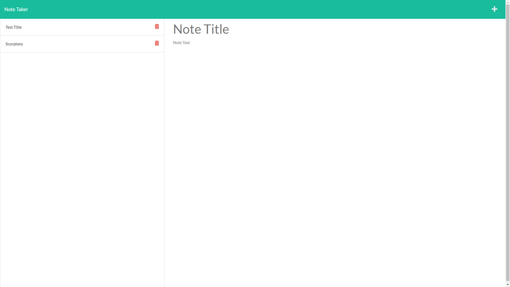

During this week 11 of UTSA's Coding Bootcamp, we were given a directive of creating a Note Taker that can be used to write and save notes. There were a number of requirements to meet, such as:

GIVEN a note-taking application
WHEN I open the Note Taker
THEN I am presented with a landing page with a link to a notes page
WHEN I click on the link to the notes page
THEN I am presented with a page with existing notes listed in the left-hand column, plus empty fields to enter a new note title and the note’s text in the right-hand column
WHEN I enter a new note title and the note’s text
THEN a Save icon appears in the navigation at the top of the page
WHEN I click on the Save icon
THEN the new note I have entered is saved and appears in the left-hand column with the other existing notes
WHEN I click on an existing note in the list in the left-hand column
THEN that note appears in the right-hand column
WHEN I click on the Write icon in the navigation at the top of the page
THEN I am presented with empty fields to enter a new note title and the note’s text in the right-hand column

We were provided starter code from @Xandromus's coding bootcamp repo: https://github.com/coding-boot-camp/miniature-eureka. All other coding was done by me in VS Code and saved in GitHub and Heroku. This project used HTML, CSS, Bootstrap, JavaScript, JSON, ExpressJS, and Heroku.

You can find my repo code here: https://github.com/amhernandez1163/11-Note-Taker

The deployed app in Heroku can be found here: https://sleepy-coast-32261.herokuapp.com/

